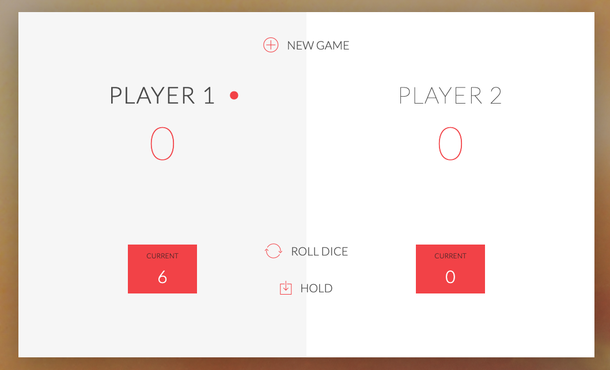

# JS-Game

🐷🐷<b><u>Pig Game</u><b> 🐷🐷

🏋🏋<b>Skills covered</b>🏋🏋
<ul>
    <li>How to create fundamental game variables.</li>
    <li>How to generate a random number.</li>
    <li>How to manipulate the DOM.</li>
    <li>How to read the DOM.</li>
    <li>How to change CSS styles.</li>
</ul>

🎲🎲<b>Game rules</b>🎲🎲
<ul>
    <li>The game has 2 players, playing in rounds.</li>
    <li>In each turn, a player rolls a dice as many times as he whishes. Each result get added to his ROUND score.</li>
    <li>BUT, if the player rolls a 1, all his ROUND score gets lost. After that, it's the next player's turn.</li>
    <li>The player can choose to 'Hold', which means that his ROUND score gets added to his GLBAL score. After that, it's the next player's turn.</li>
    <li>The first player to reach 100 points on GLOBAL score wins the game.</li>
</ul>

